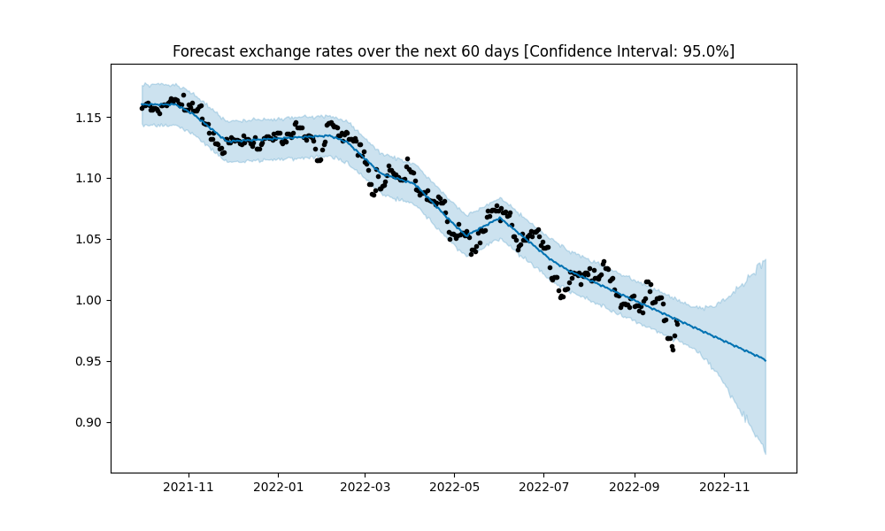

# Exchange Rates Analysis and Prediction

In this project, I analyse exchange rate changes and attempt to create a model predicting future rates. I extract data from an API and process it in Python using libraries such as 'requests', 'pandas', and 'matplotlib' among others. 

As a disclaimer, I am well aware that exchange rate prediction is an incredibly complex entreprise that even the most trained finance analysts struggle to undertake successfully. For this reason, my efforts to build a predictive model is not meant to guide consequential investment decisions. Rather,  it is a 'hands-on' attempt to learn essential skills and use key tools used in data analysis, applied to a problem that affects my everday life. 

## Rationale

As an expatriate student - first in London and now in Washington D.C.- my family supports me by regularly sending money. This money, earned in euros is subject to the fluctutions of exchange rates. Finding the correct window of opportunity, where exchange rates are optimal, can save a consequential amount of money. At this game, my father has essentially played a guessing name up until now. 

My objective is to inform his decision making in order to optimise those transfers and therefore save money. Additionally, predicting exchange rates could also be helpful in the budgeting of my family's worldwide travels.

Skip the implementation details by clicking [here](#analyzing-exchange-rate-fluctuations)

## Explore exchange rates fluctuations (method)
### Pulling the exchange rates
**Finding the right API**
At the basis of this project is data extracted from the web using an API. The criteria guiding the choice of this API include:  
1. Coverage of most major global currencies
2. Real-time updates
3. High number of API calls allowed / month for a reasonable price
4. Ease of use & in-depth documentation

The [Fixer.io](https://fixer.io/) API fulfilled those criteria best according to me. It is powered by 15+ exchange rate data sources, including the European Central Bank. It can deliver real-time exchange rate data for [170 world currencies](https://fixer.io/symbols). It also includes their historical values since 1999.

Importantly, it comes with different functionalities allowing to get the latest exchange rate data for all or a specific set of currencies, retrieve time-series data and querying the API for daily fluctuation data. Those functionalities can be accessed by altering the API call's url, and will be used in the diversity of tasks performed in this project

A few limits of this API should be underlined:
1. The range of the timeframe when retriving time-series data is limited to a year. Analysing changes in exchange rates over a perdiod longer than a year will require the aggregation of different API calls. 
2. My subscription allows for a maximum of 300 daily requests. Although it is enough to perform most tasks for a project of this size, it did prompt require me to work around it in some cases as we will see later.

**The print_rates() functions**

Th print_rates() function makes the API call to fetch the exchange rate of every day in the time period specified by the user, and for a chosen pair of currencies. It then plots a graph showing the evolution of the exchange rate over the chosen time period.

Parameters of the function:
- <code>base</code>: base currency [e.g. 'USD']
- <code>currency1</code>: quote currency [e.g. 'EUR']
    - the currrency code must be included in quotation marks
    - the list of supported currency codes is available [here](https://fixer.io/symbols)
- <code>amount_of_days</code>: length of the time period examined in days [e.g. 30]
    - maximum = 365
- <code>end_day</code> (optional): end of the time period examined [e.g. '07-03-2001']
    - if no end date is provided, it is assigned to the date at which the program is run
    - format (including the quotation marks): 'mm-dd-yyyy'

The print_rates_double() was added to add support for a second currency simultaneously studied. It allows to compare the evolution of two different currencies against the base currency. 

### Exchange rate fluctuations

**The get_fluctuations_agg() function**

This function is the cornerstone of my study of exchange rates fluctuations. It makes use of the '/fluctuation' endpoint of the API that returns the total change (absolute or in percent) of the exchange rate between two days within a year of one another.

By combining this functionality with a 'for' loop, the function returns a history of exchange rates fluctuations for any number of a time interval chosen by the user. For example, this interval can be 30 days, allowing to observe monthly fluctuations of the exchange rate. An interval of 1 gives the daily changes while inputting 365 allows to compare years.

Parameters of the function:
- <code>base</code>: base currency [e.g. 'USD']
- <code>currency1</code>: quote currency [e.g. 'EUR']
    - the currrency code must be included in quotation marks
    - the list of supported currency codes is available [here](https://fixer.io/symbols)
- <code>interval</code>: span of the time interval in days 
    - maximum = 365
- <code>timeframe</code>: number of time the interval is repeated
- <code>end_day</code> (optional): end of the time period examined [e.g. '07-03-2001']
    - if no end date is provided, it is assigned to the date at which the program is run
    - format (including the quotation marks): 'mm-dd-yyyy'

*Example of use*: <code>get_fluctuations_agg("USD", "EUR", 90, 6)</code> will return the change of exchange rate between US dollar and euro at the end of every trimester over the last 2 years (= 6 trimesters).

The range of customization of this function is extremely broad. The possibility of analyzing fluctuations of exchange rates over years (although later than 1999), and in 170 currencies, could allow to study major political or economic events far outside of the scope of this project.

## Analyzing exchange rate fluctuations
The exchange rate gives the relative value of a currency compared to another. Since the end of the Bretton Woods agreement in the 1970s, most countries adopted free-floating currencies, allowing exchange rates to adjust to economic and market developments. They play a vital role in a country's level of trade and, aside from factors such as interest rates and inflation, are among the most important determinants of a country's relative level of economic health. We will look at some of the major forces behind exchange rate movements:

- *Differentials in Inflation*: countries with higher inflation see their purchasing power decrease relative to other currencies. As a result they typically see depreciation in their currency against the currencies of their trading partners. A gradual and orderly currency depreciation improves a nation’s export competitiveness and may improve its trade deficit over time. However, if too abrupt and/or sizeable, it may scare foreign investors who will then pull portfolio investments out of the country, putting further downward pressure on the currency.

- *Differentials in Interest Rates*: When interest rates are high, foreign lenders in an economy will get a higher return relative to other countries. This attraction of foreign capital causes the exchange rate to rise: there is appreciation. However, the intricate relationship between interest rates and inflation complicates this simple reasoning. For example, central banks usually raise interest rates in response to rising inflation. But, if inflation rises too quickly, it can devalue a currency quicker than interest rates can compensate foreign investors.

- *Current Account Deficits*: A negative balance of trade between a country and its trading partners (= deficit in the current account) means that it requires more foreign currency than it receives through sales of exports, and it supplies more of its own currency than foreigners demand for its products. This excess demand for foreign currency and excess supply in home currency leads to a depreciation of the latter.

- *Economic Performances*: Foreign investors want to invest theur capital in stable countries with strong economic performance. A loss of confidence in a currency because of political and / or economic factors will lead to  movement of capital to the currencies of more stable countries.

### Case Study: the 2008 Financial Crisis
The adjustment of exchange rates during the financial crisis was remarkable, let us have a look at it. First, a broad overview of the exchange rates of the US dollar against two major currencies: the Euro, and the British pound. 

<code>get_fluctuations_agg("USD", "EUR", 90, 13, "11-30-2010")</code>  
<code>get_fluctuations_agg("USD", "GBP", 90, 13, "11-30-2010")</code>

  
   

From Lehman's collapse in September 2008 to June 2010, the path of exchange rates seems to have gone through 3 phases. We will see that this path is largely determined by the United States’ status as a safe haven[^1].  

**Phase 1:  September 2008 to March 2009 - The US as a safe haven**  
<code>print_rates_double("USD", "EUR", "GBP", 300, "03-31-2009")</code>
  

As seen on the graph, the dollar appreciated against both the Euro and the British Pound in the 6 months that followed Lehman's collapse. This surprising US dollar appreciation in the second half of 2008 can be explained by a range of factors[^2]. Most notably, the concept of safe haven suggests that the US dollar benefited from the global flight to safety into US Treasury bills.

**Phase 2: March 2009 to November 2009 - Confidence returns..**  
<code>print_rates_double("USD", "EUR", "GBP", 300, "11-30-2009")</code>
  

Much of the depreciation of both currencies against the dollar reversed as confidence returned. Over the 9 months following March 2009, exchange rates largely came back to pre-crisis levels in a remarkably orderly way.

**Phase 3: November 2009 to June 2010 - ..but is only temporary**  
<code>print_rates_double("USD", "EUR", "GBP", 240, "06-15-2010")</code>
  

However, after November 2009, countries in the Euro area and Great Britain have begun to see depreciation against the dollar resume. The latter was spurred amidst concerns about the euro and pound, with spillovers into the rest of Europe. The US as a 'safe haven' among other factors led a new appreciation of the dollar.

**Post-crisis: June 2010 to November 2010 - The "Currency War"**  
<code>print_rates_double("USD", "EUR", "GBP", 210, "11-30-2010")</code>
  

Finally, with many economies struggling on the offset of the financial crisis, policy makers of many nations took steps to weaken their currencies. This maneuver is meant to bolster export-driven economies by positively influencing their trade balance - imports become more expensive and exports more competitive. This effort to preserve jobs and growth at home can have a destabilizing effect on the balance of world economies still recovering from the shocks of the financial crisis. 

The dollar's depreciation, driven by quantitative easing - injection of vast sums of money by the Federal Reserve into the economy to spur growth -, led European policy makers to worry that the resurgent euro would threaten growth in European nations. Moreover, as noted in this [New York Times article](https://www.nytimes.com/2010/10/21/business/global/21dollar.html) "many other currencies, especially in Asia and in emerging markets like Brazil, are soaring as a result of the dollar’s fall. Those nations’ domestic economies are attracting floods of speculative capital seeking higher interest rates and are at risk of overheating." 

*The dollar falls sharply: USD in Brazilian Real, Indian Rupee, Thai Baht, and South Korean Won:*
  

### USD - EUR
Let us narrow the scope on the USD/EUR pair, as required by the [rationale](#rationale) of this project  

<code>print_rates("USD", "EUR", 365)</code>
  

Since the end of August, the euro trades at less than a dollar, a two-decade low, and many strategists predict further depreciation. This free fall in euro's value can be partially explained by two main factors.[^3] 
- First, inflation in the eurozone, which averaged 8.6 percent in June. The Russia-Ukraine conflict significantly increasing energy prices in Europe, while the US, given its oil reserve and use of alternative sources of energy, stays relatively immune, will only reinforce this US dollar appreciation relative to the euro.
- Second, the US Fed consistently increasing its interest rates, making investments in the US dollar area more attractive. Once again, the US currency benefits from its status as a 'safe haven', especially at times of war. 

Euro's loss in value puts the European Central Bank in a tough situation. The ECB faces a dilemma:  
- Increasing interest rates would help reduce inflation & improve currency competitiveness  
- BUT the eurozone’s anaemic growth would benefit from low interest rates.  

The only potential upside of a weak euro is a possible surge in exports that could slow down the economic stagnation of some European countries, most notably Germany and France. Germany was already enjoying a high current account surplus; a weaker euro could improve their competitiveness.

The main objective of this project is to study exchange rate variations on a short-term. We have data on the daily and want to use it to inform everyday life decisions.  
**Could we find, even in this general depreciation of the euro compared to the dollar, patterns of upswings that we could take advantage of to transfer my allowance?**

## Predicting exchange rates changes
**How does time-series prediction work?**  

We want to analyse time-series data which is a series of values (here exchange rates) obtained at successive times. Time-series data often displays two major characteristics: 
- **trend**: long-term movement of a time series
- **seasonality**: patterns or cycles that repeat over time  

Many models used for forecasting exploit these characteristics. Trained on historical data, they use trends and patterns, to produce short or long-term predictions. Because those models are based on algorithms that 'learn' from past data to predict future values, they are considered as part of machine learning (ML).

There are two types of time-series:
- *Univariate*: only one variable is varying over time
- *Multivariate*: multiple variables are varying over time  

Furthermore, time-series models can be broadly classified into two categories:
- *Traditional Time-series models*:
    - Univariate models: e.g. ARIMA (& SARIMA), Exponential Smoothing (ES), Long Short-Term Memory (LSTM), Facebook's Prophet (& NeuralProphet)
    - Multivariate models: e.g. Vector Autoregression
- *Regression models*: on the contrary of traditional models that are recursive (can predict the variable over extended periods of time), regression models make predictions directly depending on the horizon. They use independent variables found in the training data to predict the dependent variable on a certain date.
    - e.g. Neural Network Regressor, Catboost Regressor...

**Which method to choose for the prediction of exchange rates?**  
The choice of model was guided by the following questions:  
- *Am I facing a univariate or multivariate time series forecasting problem?*  
- *How accurate do I want the model to be?*  
- *How much volume of data is available?*  
- *What is the time horizon of predictions required?*  

The time-series data I am working with is univariate: the exchange rate is the only variable that varies over time. Vector Autoregression models are therefore inappropriate. So are standard machine learning regression models, especially because I want to be able to predict exchanges rates in a medium-run horizon, not on a precise date. We are left with traditional time-series univariate models. Among them, Prophet is the most fitting to my data and objectives. It performs well and is also notoriously easier to implement and better tailored for users that are not experts in time-series analysis than its counterparts.

### Prophet: predicting time-series data using machine learning

[Facebook Prophet](https://facebook.github.io/prophet/) is an open-source algorithm for generating univariate time-series models. As explained in their [Github Page](https://github.com/facebook/prophet), "is a procedure for forecasting time series data based on an additive model where non-linear trends are fit with yearly, weekly, and daily seasonality, plus holiday effects." The documentation claims that "Prophet is robust to missing data and shifts in the trend, and typically handles outliers well."  At its core is the sum of three functions of time:growth g(t), seasonality s(t), holidays h(t), plus an error term
- $$y(t) = g(t) + s(t) + h(t) + e_t$$

Having introduced the model, let us jump right into its implementation. The <code>forecast(df, ci, period)</code> function receives 3 arguments:

- <code>df</code>: pandas dataframe that contains two columns: exchange rates, and the dates over which they are measured (in datetime format)
    - the <code>get_rates()</code> function detailed earlier allows to get this dataframe over any number of days (< 365)
- <code>period</code>: number of days in the future for which exchange rates are forecast
- <code>ci</code> (optional): confidence interval for the forecast (displayed on the graph as the blue area)
    - default value: 0.95 (95%)

  
  

**Limitations**

### Potential follow-ups
**Improving the accuracy of the model**: a multivariate model could include other dependent variables, chosen using the exploratory data analysis takeaways. Such variables could include:
- inflation
- interest rates
- trade balance
- other factors of economic performance: political regimes, events etc..

**Improving data visualization**: many of the functions created in this project have a broad range of customization; dates, currencies, confidence interval among others. A web application would allow users to make full use of this customization. They could access historical and predicted exchange rates for over 150 currencies in a couple of clicks.

## Personal takeaways & skills developed
*Tools & Data Analysis* 
This project allowed me to use a variety of tools across all the steps of a machine learning analysis of time-series data in Python. Being able to work with this type of data is extremely valuable. Time-series are central in a lot of domains, from investment banking models to climate change forecasting, through sales predictions for businesses and many others.

*Data Collection & Preparation* 
- Python libraries: requests, pandas
- Web-scraping using APIs
- Working with dictionaries, dataframes, using loops
- Thinking outside of the box and looking for the best resources to solve problems 

*Exploratory Data Analysis* 
- Python libraries: matplotlib.plotly, datetime
- Think critically about data
- Creating informative and appealing plots
- Communicating findings clearly and concisely: turn raw data into useful information

*Forecasting with Machine Learning* 
- Python libraries: matplotlib, datetime
- Make informed and justified choices about the model
- Think critically about the results of the model, its limitations, how it could be improved

[^1]: [Carnegie Endowment for International Peace](https://carnegieendowment.org/2010/02/10/exchange-rates-and-crisis-dog-that-didn-t-bark-pub-24842)
[^2]: McCauley, R. N., & McGuire, P. (2009). Dollar appreciation in 2008: safe haven, carry trades, dollar shortage and overhedging. BIS Quarterly Review December.
[^3]: [Al Jazeera](https://www.aljazeera.com/news/2022/7/13/what-prompted-euros-parity-with-us-dollar-and-whats-its-impact)